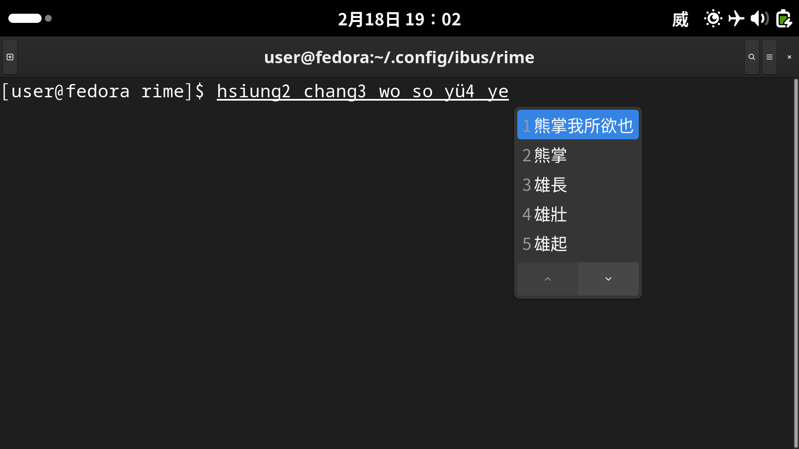
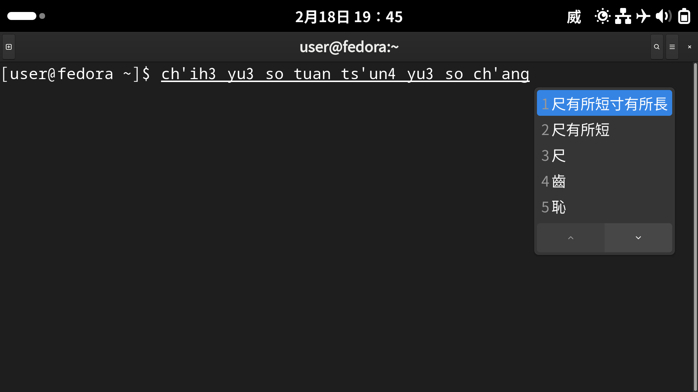

# 修訂版威妥瑪拼音輸入方案

### What is this?

An input schema for [rime](https://github.com/rime/home). This is based on a modified version of [Wade–Giles romanization](https://www.britannica.com/topic/Wade-Giles-romanization).
Letters like `b`, `q`, `x` (and also `g` or `r` at beginning) are not used in that (unmodified) system, so they will behave the same as if in Pinyin, and so will Pinyin-style letter combinations if not causing conflicts.

For example, `思` may be input by typing `si`, `ssu` or `szu`, while `z` (in other combinations) will usually mean the same as `ts` or `tz`.

The apostrophe (`'`, the same symbol in the keyboard as the single quote) is used in this schema to indicate aspiration but not separation. (Due to technical limitation, only one purpose is allowed.) It is required for some words, but its placement (i.e., where you place it) is not strictly defined as it was in the original system.

For example, `ts'`, `tz'`, `t's` and `t'z` can all mean the same in some cases (but at the same time also be different from `ts` and `tz`; in this schema, it's the apostrophe that makes any difference).

As described above, the rules are relatively loose comparing to the original system.

### What's the point of this?

It allows you to enter `易經`/`易经` by typing `i ching`, which is correct Wade–Giles.

As a system for romanization, Wade–Giles is really not good. (It would not be discarded otherwise.) But using something as an input method is different from using it to (directly) communicate with other people or make documents. Its confusingness is almost not a problem here, as whatever you type will not be directly stored but converted to another kind of characters.

### Do I need it?

No, you generally don't need it unless your keyboard lacks `B`, `Q` or `X`. The main purpose of this project is only to demonstrate how this can be done.

### Screenshots

### Note

* The name of this schema will be displayed in softwares as “威式拼音修訂版”.

* Use `v` for `ü` (e.g., `yv`, `chv`, `ch'v`, `hsv`). Sometimes you can also use `u` for it just as in Pinyin. don't use `yu` except in cases mentioned below: `yu` in Wade–Giles means the same as `you` in Pinyin or (nonstandard) an `yü` (`yu` in Pinyin) with the umlaut removed, so if you try to use it, you will get mixed suggestions. Hence, it's recommended to type `yv` for `yü` (because original Wade–Giles system uses the umlaut in this case) and `you` for `you` (Pinyin) to avoid ambagiousness.

* Tones are specified by numbers (but doing so is not required.), and are displayed as numbers (as in original Wade–Giles). The neutral tone is the fifth tone.

* Use tone-indicators (numbers 1 to 5) to split syllables. Apostrophes, as explained above, can't be used for it (despite allowed in Wade–Giles).

* The use of an apostrophe (for aspiration) is sometimes enforced in this schema. However, for ease of inputting, its positions, as described above, is not strictly defined (in this schema). Allowed placements include:

    * (standard) between the last initial consonant letter and the first vowel letter, e.g., `tz'u`;

    * (nonstandard) between two initial consonant letters, e.g., `t'zu`;

    * (nonstandard) after the last of the final letters but before the tone-indicator, e.g., `tzu'`, `tzu'3`.

* The functions of several keys are redefined. Both the space key and the return/enter key will confirm selection.

* You may use `so` instead of `suo` (and `lo` instead of `luo`), because the former is just how it is romanized in Wade–Giles. Strange but useful here.

* For a code table, see the table in Encyclopedia Britannica or that in Wikipedia. (See <a href="#References">references</a>.)

### Tips

* Not all keys on the keyboard are required when using this schema, so you don't have to remember the whole keyboard in order to use it (even if you can remember, your speed of inputting will not get increased when using this schema). Don't try to use all keys of the keyboard; find the positions of the most used keys (usually `C`, `H`, `T`, `S`, `'` (apostrophe) and vowels) and focus on them!

* Using only a part of the keyboard and further relying heavily on some of the keys (which is just what this schema does) implies low information entropy. Don't try to select each individual letter; type more letters and use the context to filter them (and then delete additional letters if any).

### References

1. <https://www.britannica.com/topic/Wade-Giles-romanization>

2. <https://en.m.wikipedia.org/wiki/Wade%E2%80%93Giles_table>